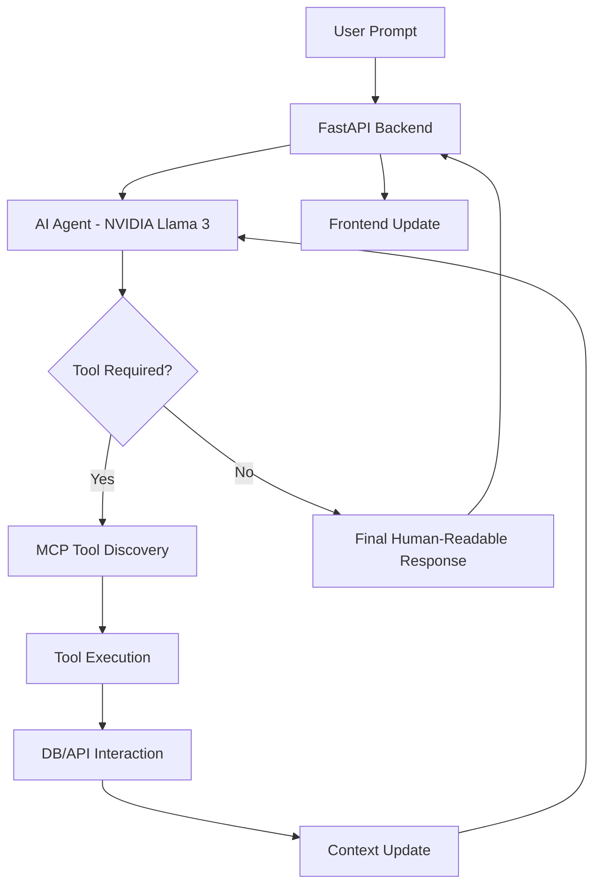
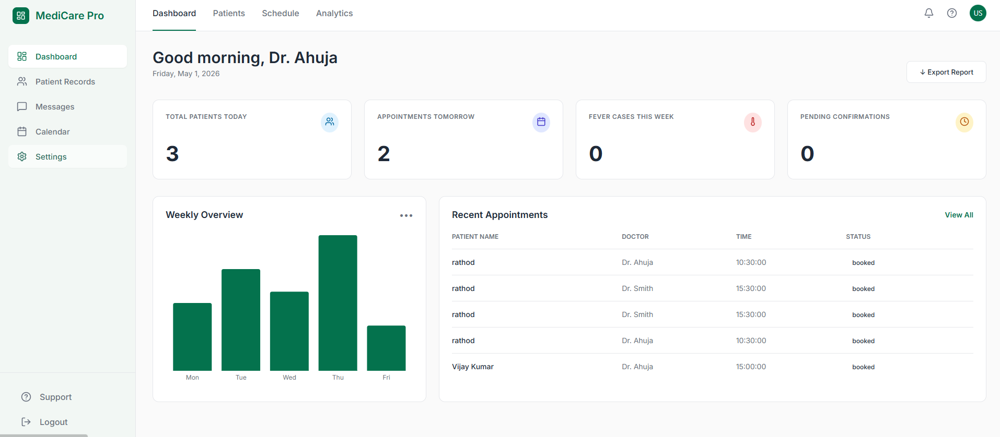

# Smart Doctor Appointment & Reporting Assistant (MCP-Enabled)

An agentic AI medical assistant that helps patients schedule appointments and provides doctors with smart clinic analytics. This system uses the **Model Context Protocol (MCP)** to dynamically discover and invoke tools for database queries, calendar management, and automated notifications.

## 🚀 Features

- **Agentic AI Chat:** Natural language processing for booking and clinic queries.
- **Role-Based Dashboards:** 
  - **Patients:** View available doctors, book appointments, and see personal history.
  - **Doctors:** Access clinic metrics, patient records, and automated summary reports.
- **MCP Tool Integration:**
  - **Google Calendar API:** Real-time slot booking and availability checking.
  - **Gmail (SMTP):** Automated email confirmations to patients.
  - **Clinic Database:** PostgreSQL-based tracking of appointments and history.
- **Mobile Responsive:** Fully optimized for smartphones and tablets with a custom dot-menu sidebar.

## 🛠️ Tech Stack

- **Frontend:** React, Lucide Icons, Recharts, Moment.js.
- **Backend:** FastAPI (Python), SQLAlchemy, Pydantic.
- **AI/LLM:** NVIDIA AI Foundation (Llama-3 models) with function calling.
- **Tools:** Model Context Protocol (MCP), Google Calendar API, SMTP.

## 🔄 Backend Workflow (Agentic AI Flow)

The system operates as an **Autonomous Agent** rather than a standard request-response API. Here is how the backend orchestrates tool usage:



1.  **Context Injection:** The backend injects the current date, user role (Doctor/Patient), and session history into the LLM system prompt.
2.  **Tool Discovery:** The LLM identifies the intent (e.g., "book appointment") and selects the appropriate MCP tool (`book_appointment`).
3.  **Autonomous Execution:** The agent executes the tool, which handles database entry, Google Calendar sync, and Email notification in one atomic operation.
4.  **Verification:** The agent verifies the tool output and provides a concise confirmation to the user.

## ⚙️ Setup Instructions

### Prerequisites
- Python 3.10+
- Node.js & npm
- Google Cloud Console project (for Calendar API)

### 1. Backend Setup
```bash
cd backend
python -m venv venv
source venv/bin/activate  # Windows: venv\Scripts\activate
pip install -r requirements.txt
```

Create a `.env` file in the `backend` folder:
```env
DATABASE_URL=sqlite:///./doctor_ai.db
NVIDIA_API_KEY=your_nvidia_api_key
SMTP_USERNAME=your_gmail@gmail.com
SMTP_PASSWORD=your_app_password
```

Place your `credentials.json` from Google Cloud in the `backend` folder.

### 2. Frontend Setup
```bash
cd frontend
npm install
```

### 3. Running the App
Start Backend:
```bash
python main.py
```
Start Frontend:
```bash
npm run dev
```

## 🔐 Demo Credentials

To access the different dashboards, use the following credentials:

### **Doctor Dashboard**
- **Email:** `admin@medicare.com`
- **Password:** `admin123`
- **Role:** Select "Doctor" toggle

### **Patient Dashboard**
- **Email:** `john@example.com` (or register a new one)
- **Password:** `securepassword123`
- **Role:** Select "Patient" toggle

---

## 💬 Sample Prompts

### For Patients:
- "I want to book an appointment with Dr. Ahuja tomorrow morning."
- "What slots are available for Dr. Smith on Monday?"
- "Can you show me my past appointments?"

### Patients screenshot 
### Login


### chat Screenshot


### Booked calender Screenshot


### confirmation email Screenshot


### Dashboard Screenshot


### Booked history Screenshot

### For Doctors:
- "How many appointments do I have today?"
- "What are the common symptoms patients have reported this week?"
- "Generate a clinic summary report for me."

### For Doctors screenshot
### Login


### Chat screenshots


### Schedule screenshot


### dashbaord screenshots

<!--  -->
---
*Developed as part of the Agentic AI Developer Intern Assignment.*
